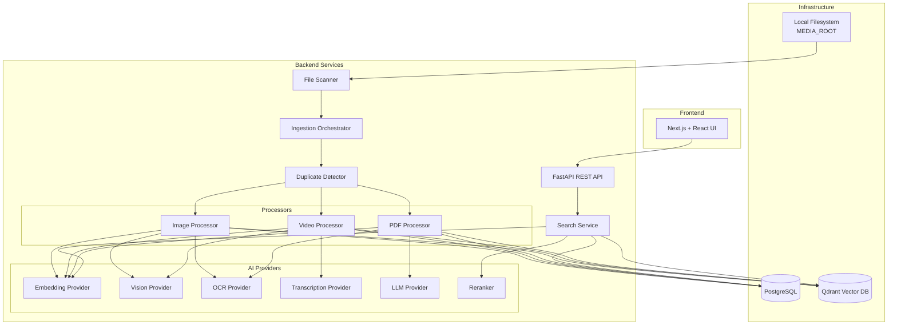

# Architecture Document

## System Overview

The AI-Powered Digital Asset Management (DAM) system is a modular, locally runnable application that indexes and enables semantic search across images, videos, and PDF documents using multimodal AI understanding.

## High-Level Architecture



## Component Details

### 1. File Scanner (`backend/app/domain/indexing/scanner.py`)
- Recursively walks `MEDIA_ROOT`
- Identifies supported file types (images, videos, PDFs)
- Extracts basic metadata (size, mtime, extension, MIME type)
- Calculates SHA-256 content hash
- Applies configurable ignore patterns

### 2. Duplicate Detector (`backend/app/domain/indexing/duplicate_detector.py`)
- Uses SHA-256 hash for exact duplicate detection
- Creates `DuplicateGroup` records linking multiple paths to same content
- Prevents reprocessing of identical content

### 3. Ingestion Orchestrator (`backend/app/domain/indexing/orchestrator.py`)
- Coordinates the ingestion pipeline
- Manages processing state machine (DISCOVERED → QUEUED → PROCESSING → COMPLETED/FAILED/SKIPPED/DUPLICATE)
- Handles batch processing with configurable concurrency
- Implements retry logic with exponential backoff
- Provides progress tracking and resumability

### 4. Modality Processors

#### Image Processor (`backend/app/processors/image/processor.py`)
- Validates image files
- Extracts metadata (dimensions, format, EXIF)
- Generates visual embeddings via `EmbeddingProvider`
- Generates semantic descriptions via `VisionProvider`
- Extracts OCR text via `OCRProvider` when enabled

#### Video Processor (`backend/app/processors/video/processor.py`)
- Extracts video metadata (duration, FPS, resolution, codec)
- Implements intelligent frame sampling (configurable interval, max frames)
- Processes sampled frames through vision pipeline
- Generates frame-level embeddings and descriptions
- Optional audio extraction and transcription via `TranscriptionProvider`
- Aggregates frame data into video-level representation with timestamps

#### PDF Processor (`backend/app/processors/pdf/processor.py`)
- Validates PDF files
- Extracts metadata (page count, document info)
- Extracts text content (native + OCR fallback)
- Chunks document by pages/sections
- Generates embeddings for chunks
- Generates document-level summary via `LLMProvider`

### 5. AI Provider Abstractions (`backend/app/ai/`)

All AI capabilities are behind interfaces for replaceability:

```python
# Embeddings
class EmbeddingProvider(Protocol):
    def embed_text(self, texts: list[str]) -> list[list[float]]: ...
    def embed_image(self, images: list[Image]) -> list[list[float]]: ...

# Vision Analysis
class VisionProvider(Protocol):
    def analyze_image(self, image: Image) -> VisionResult: ...
    def analyze_frames(self, frames: list[Image]) -> list[VisionResult]: ...

# OCR
class OCRProvider(Protocol):
    def extract_text(self, image: Image) -> OCRResult: ...

# Transcription
class TranscriptionProvider(Protocol):
    def transcribe(self, audio_path: Path) -> TranscriptResult: ...

# LLM
class LLMProvider(Protocol):
    def generate(self, prompt: str, **kwargs) -> str: ...
    def summarize(self, text: str) -> str: ...

# Reranking
class Reranker(Protocol):
    def rerank(self, query: str, candidates: list[Candidate]) -> list[Candidate]: ...
```

### 6. Search Service (`backend/app/search/`)

Implements hybrid retrieval pipeline:

```
User Query
    ↓
Query Normalization & Intent Parsing
    ↓
Parallel Retrieval
    ├── Vector Search (Qdrant)
    ├── Lexical Search (PostgreSQL FTS)
    └── Metadata Filtering
    ↓
Candidate Fusion (RRF / weighted)
    ↓
Deduplication
    ↓
Reranking (optional cross-encoder)
    ↓
Final Ranked Results with Explanations
```

### 7. Data Layer

#### PostgreSQL (Source of Truth)
- Asset metadata, processing state, relationships
- Full-text search indexes for lexical retrieval
- Normalized schema with versioning support

#### Qdrant (Vector Search)
- Stores embeddings with payload for filtering
- Supports semantic similarity search
- Modality-aware collections

### 8. API Layer (`backend/app/api/`)

RESTful endpoints:
- `GET /api/health` - Health check
- `POST /api/index/start` - Start indexing
- `GET /api/index/status` - Indexing progress
- `POST /api/index/retry-failed` - Retry failed items
- `GET /api/assets` - List assets with filters
- `GET /api/assets/{id}` - Asset detail
- `GET /api/assets/{id}/preview` - File preview
- `POST /api/search` - Semantic search
- `GET /api/stats` - Dashboard statistics
- `GET /api/filters` - Available filter options

### 9. Frontend (`frontend/`)

Next.js 14+ App Router with:
- Dashboard with indexing statistics
- Search interface with filters and results grid
- Asset detail views (image viewer, video player, PDF viewer)
- Indexing progress page with live updates
- shadcn/ui components + Tailwind CSS

## Data Flow

See [DATA_FLOW.md](DATA_FLOW.md) for detailed data flow diagrams.

## Configuration

All configuration via environment variables (see `.env.example`):
- Media root path
- Database/Qdrant connections
- AI provider selection and model names
- Processing parameters (workers, frame limits, etc.)
- Search ranking weights
- Feature flags (OCR, transcription, etc.)

## Replaceability Guarantees

| Component | Abstraction | Implementation |
|-----------|-------------|----------------|
| Vector DB | `VectorStore` protocol | `QdrantVectorStore` |
| Embeddings | `EmbeddingProvider` | `CLIPEmbeddingProvider`, `SigLIPEmbeddingProvider` |
| Vision | `VisionProvider` | `LLaVAVisionProvider`, `GPT4VisionProvider` |
| OCR | `OCRProvider` | `TesseractOCRProvider`, `PaddleOCRProvider` |
| Transcription | `TranscriptionProvider` | `WhisperProvider`, `FasterWhisperProvider` |
| LLM | `LLMProvider` | `OllamaLLMProvider`, `LocalLLMProvider` |
| Reranker | `Reranker` | `CrossEncoderReranker`, `CohereReranker` |

## Scalability Considerations

Current: Modular monolith suitable for local development (10GB+ datasets)
Future: See [PRODUCTION_IMPROVEMENTS.md](PRODUCTION_IMPROVEMENTS.md)