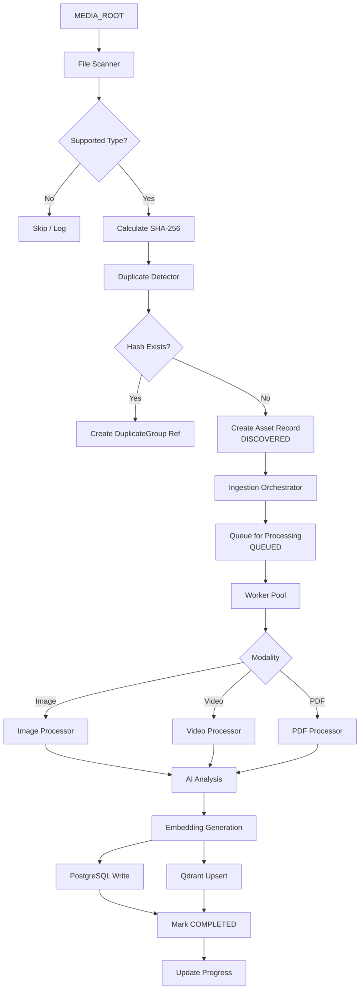
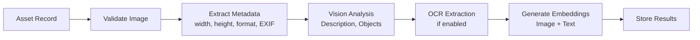
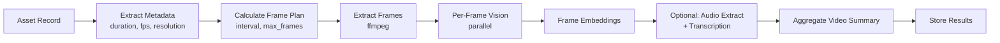
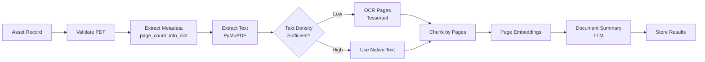
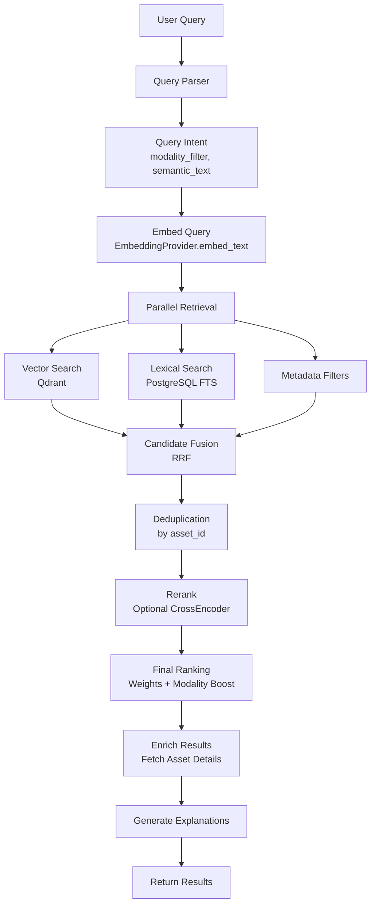
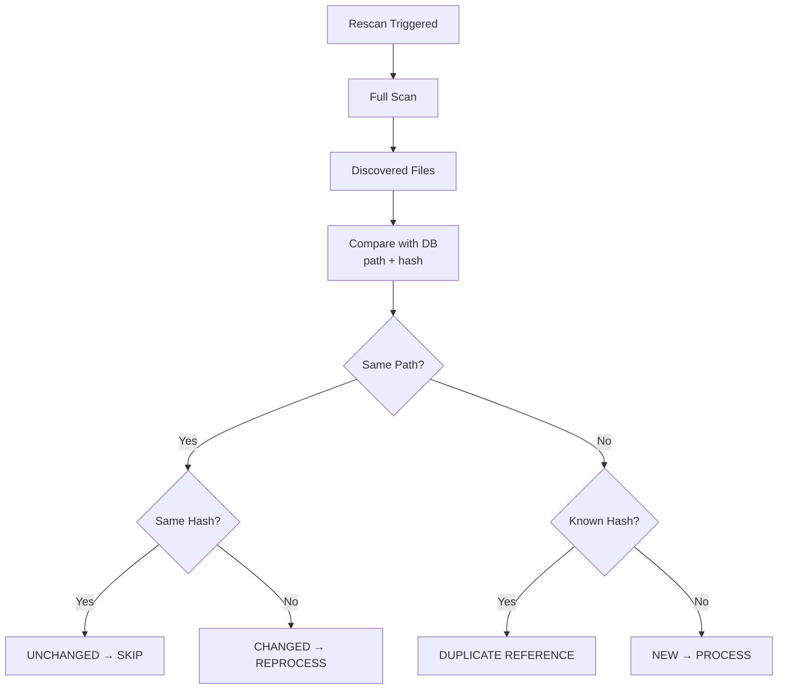
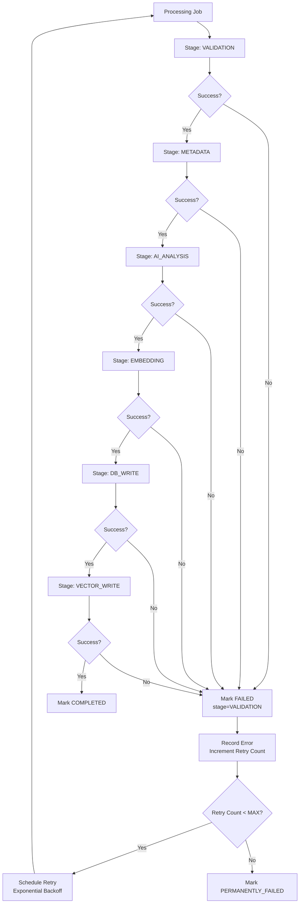
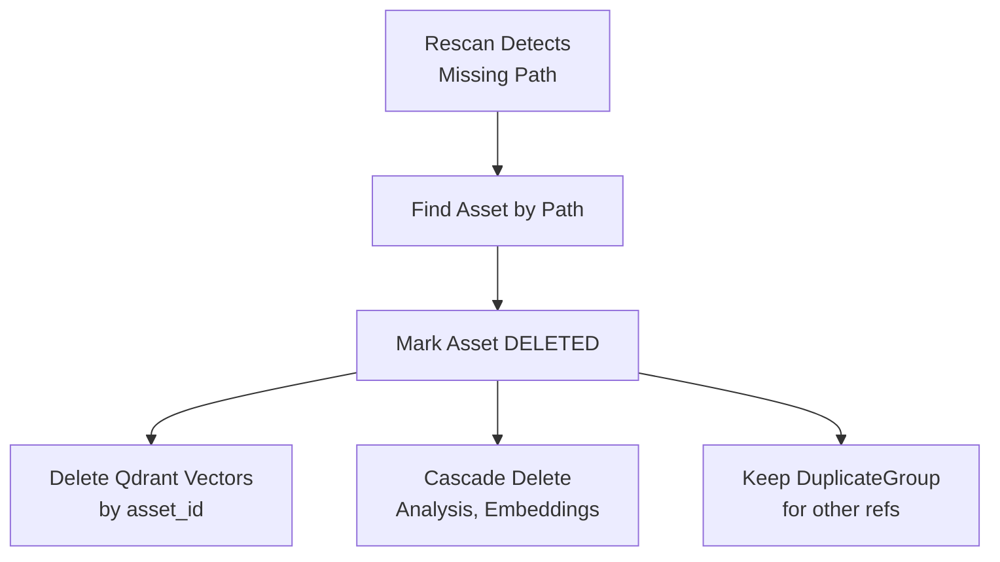

# Data Flow Documentation

## Overview

This document describes the end-to-end data flows in the DAM system, from file discovery to search results.

---

## 1. Ingestion Pipeline Data Flow



### 1.1 File Scanner (`domain/indexing/scanner.py`)

**Input**: `MEDIA_ROOT` path, supported extensions config, ignore patterns

**Process**:
1. Recursive walk of `MEDIA_ROOT`
2. Filter by extension (images: jpg,jpeg,png,webp | videos: mp4,mov,mkv,avi,webm | docs: pdf)
3. Apply ignore patterns (hidden files, temp files, thumbnails)
4. For each file: stat → extract metadata (size, mtime, extension, MIME type)
5. Calculate SHA-256 hash (streaming, chunked)
6. Emit `DiscoveredFile` objects

**Output**: `list[DiscoveredFile]` with:
- `path`: absolute path
- `relative_path`: relative to MEDIA_ROOT
- `filename`: basename
- `extension`: lowercased
- `mime_type`: detected
- `file_size`: bytes
- `modified_time`: mtime
- `sha256`: content hash

### 1.2 Duplicate Detection (`domain/indexing/duplicate_detector.py`)

**Input**: `list[DiscoveredFile]`

**Process**:
1. Query PostgreSQL for existing `Asset` records with matching `sha256`
2. For each file:
   - If hash exists → create `DuplicateGroup` entry linking new path to existing asset
   - Mark file as `DUPLICATE` with reference to canonical asset
   - If hash new → proceed to asset creation

**Output**: Partitioned files → `new_files`, `duplicates`

### 1.3 Asset Creation & Queueing

**Input**: `new_files` (deduplicated)

**Process**:
1. Create `Asset` record per file with state `DISCOVERED`
2. Create `ProcessingJob` per asset with state `QUEUED`
3. Commit transaction
4. Orchestrator picks up `QUEUED` jobs

**Output**: Assets in queue

### 1.4 Modality Processing

#### Image Processing (`processors/image/processor.py`)



**AI Calls**:
- `VisionProvider.analyze_image()` → `VisionResult(description, objects, tags)`
- `OCRProvider.extract_text()` → `OCRResult(text, confidence, bbox)`
- `EmbeddingProvider.embed_image()` → `list[float]` (512-dim)
- `EmbeddingProvider.embed_text()` → `list[float]` (for description + OCR)

**PostgreSQL Writes**:
- `Asset` → update metadata, state
- `MediaMetadata` → width, height, format, exif_json
- `ImageAnalysis` → description, objects_json, ocr_text, ocr_confidence
- `Embedding` → vector_id, model_name, modality, content_type

**Qdrant Upserts**:
- Collection: `assets_image`
- Point: `vector_id` = embedding.id
- Vector: image_embedding (primary), text_embedding (secondary)
- Payload: `asset_id`, `modality`, `description`, `ocr_text`, `path`, `metadata`

#### Video Processing (`processors/video/processor.py`)



**Frame Sampling Algorithm**:
```
if duration <= 60s:     interval = 2s, max_frames = 30
elif duration <= 300s:  interval = 5s, max_frames = 60
else:                   interval = 10s, max_frames = 64
```
Configurable via `VIDEO_SAMPLE_INTERVAL_SECONDS`, `VIDEO_MAX_FRAMES`

**AI Calls**:
- `VisionProvider.analyze_frames()` → `list[VisionResult]`
- `EmbeddingProvider.embed_image()` per frame → `list[list[float]]`
- `TranscriptionProvider.transcribe()` → `TranscriptResult` (if enabled)

**PostgreSQL Writes**:
- `Asset` → update metadata, state
- `MediaMetadata` → duration, fps, resolution, codec
- `VideoAnalysis` → summary, frame_count, processed_frames
- `VideoFrame` (per frame) → timestamp, frame_number, description, embedding_id
- `Transcript` (if enabled) → full_text, segments_json
- `Embedding` records for each frame + video-level

**Qdrant Upserts**:
- Collection: `assets_video`
- Points: one per frame + video-level aggregate
- Payload includes `timestamp`, `frame_number`, `asset_id`

#### PDF Processing (`processors/pdf/processor.py`)



**Text Density Heuristic**:
- Extract text per page
- If chars/page < 100 → likely scanned → trigger OCR
- Otherwise use native text

**AI Calls**:
- `OCRProvider.extract_text()` per scanned page
- `EmbeddingProvider.embed_text()` per page chunk
- `LLMProvider.summarize()` for document summary

**PostgreSQL Writes**:
- `Asset` → update metadata, state
- `MediaMetadata` → page_count, pdf_info_json
- `DocumentAnalysis` → summary, total_chars, ocr_pages_count
- `DocumentPage` (per page) → page_number, text, char_count, embedding_id
- `Embedding` records per page

**Qdrant Upserts**:
- Collection: `assets_document`
- Points: one per page chunk
- Payload: `asset_id`, `page_number`, `text_preview`, `path`

---

## 2. Search Pipeline Data Flow



### 2.1 Query Parsing (`search/query_parser.py`)

**Input**: Raw query string, optional explicit filters

**Process**:
1. Detect modality intent via keywords:
   - "video", "clip", "footage" → `modality_filter=video`
   - "image", "photo", "picture" → `modality_filter=image`
   - "document", "pdf", "brochure", "floor plan" → `modality_filter=document`
2. Extract semantic query (remove modality keywords)
3. Parse explicit filters (size, date, path)

**Output**: `QueryIntent(semantic_query, modality_filter, filters)`

### 2.2 Vector Search (`search/retrieval.py`)

**Input**: Query embedding, modality filter, top_k

**Process**:
1. Select Qdrant collection(s) based on modality filter
2. Execute `search_batch` with:
   - Vector: query embedding
   - Filter: modality + any metadata filters
   - Limit: `top_k * 3` (over-fetch for fusion)
3. Return scored candidates with payload

### 2.3 Lexical Search (`search/retrieval.py`)

**Input**: Query text, modality filter, top_k

**Process**:
1. Use PostgreSQL `tsvector`/`tsquery` on:
   - `ImageAnalysis.description`, `ocr_text`
   - `VideoAnalysis.summary`, `Transcript.full_text`
   - `DocumentAnalysis.summary`, `DocumentPage.text`
   - `Asset.filename`, `relative_path`
2. Rank by `ts_rank_cd`
3. Return top_k with scores

### 2.4 Candidate Fusion (`search/ranking.py`)

**Algorithm**: Reciprocal Rank Fusion (RRF)

```
score = 0
for each candidate in vector_results:
    score += 1 / (k + rank_vector)
for each candidate in lexical_results:
    score += 1 / (k + rank_lexical)
```
where `k = 60` (standard)

**Modality Boost**: If query has modality intent, boost matching modality by `MODALITY_WEIGHT`

### 2.5 Reranking (Optional) (`search/reranker.py`)

**Input**: Fused candidates (top 50), query text

**Process**:
1. If `Reranker` configured:
   - Prepare pairs: `(query, candidate_text)`
   - Call `Reranker.rerank()` → reordered scores
2. Else: Use fused scores

### 2.6 Final Ranking & Explanation (`search/ranking.py`)

**Final Score Formula**:
```
final_score = 
    semantic_score * SEMANTIC_WEIGHT +
    lexical_score * LEXICAL_WEIGHT +
    modality_score * MODALITY_WEIGHT +
    metadata_score * METADATA_WEIGHT
```

**Explanation Generation**:
- For each result, trace back match sources:
  - Vector: "Visual similarity to 'modern living room'"
  - Lexical: "Exact term 'Project Alpha' in filename"
  - Metadata: "Matches filter: type=video"
  - Video: "Matched at frame 03:24 (description: 'construction activity')"
  - PDF: "Matched on page 12 (text: 'residential development')"

---

## 3. Incremental Indexing Flow



**State Transitions**:
- `UNCHANGED`: Asset state remains `COMPLETED`, no AI calls
- `CHANGED`: Asset state → `QUEUED`, version incremented, old vectors deleted
- `DUPLICATE REFERENCE`: New `DuplicateGroup` entry, no new asset
- `NEW`: Normal ingestion flow

---

## 4. Failure Handling & Retry Flow



**Retry Policy**:
- Max retries: 3 (configurable)
- Backoff: 60s, 300s, 1800s
- Transient errors (network, GPU OOM) → retry
- Permanent errors (corrupt file, unsupported format) → no retry

---

## 5. Asset Deletion Flow



---

## 6. Data Models Summary

### Core Tables (PostgreSQL)

| Table | Purpose |
|-------|---------|
| `asset` | Core asset record, path, hash, state |
| `asset_version` | Version history for changed files |
| `media_metadata` | Technical metadata (dims, duration, pages) |
| `image_analysis` | Vision results, OCR |
| `video_analysis` | Video summary, frame count |
| `video_frame` | Per-frame data with timestamps |
| `document_analysis` | PDF summary, stats |
| `document_page` | Per-page text, embeddings |
| `transcript` | Audio transcription |
| `embedding` | Embedding records linking to Qdrant |
| `processing_job` | Job queue with state, stage, retries |
| `duplicate_group` | Hash → multiple paths |
| `search_query` | Query log for evaluation |

### Qdrant Collections

| Collection | Vector | Payload |
|------------|--------|---------|
| `assets_image` | 512-dim (image/text) | asset_id, modality, description, ocr_text, path |
| `assets_video` | 512-dim (frame/image) | asset_id, timestamp, frame_number, description |
| `assets_document` | 512-dim (text) | asset_id, page_number, text_preview, path |

---

## 7. Consistency Guarantees

### PostgreSQL → Qdrant Write Order
1. Write to PostgreSQL first (source of truth)
2. Write to Qdrant
3. If Qdrant fails: Job marked `FAILED` at `VECTOR_WRITE` stage
4. Reconciliation job scans for `COMPLETED` assets without vectors

### Reconciliation
- Periodic job compares `Asset.embedding_ids` with Qdrant
- Repairs missing vectors by re-embedding
- Removes orphaned vectors (asset deleted but vectors remain)

---

## 8. Configuration Points Affecting Data Flow

| Env Var | Affects |
|---------|---------|
| `MEDIA_ROOT` | Scanner root |
| `SUPPORTED_IMAGE_EXTS` | Scanner filter |
| `SUPPORTED_VIDEO_EXTS` | Scanner filter |
| `SUPPORTED_DOC_EXTS` | Scanner filter |
| `IGNORE_PATTERNS` | Scanner ignore |
| `VIDEO_MAX_FRAMES` | Frame sampling |
| `VIDEO_SAMPLE_INTERVAL_SECONDS` | Frame sampling |
| `ENABLE_OCR` | Image/PDF OCR |
| `ENABLE_VIDEO_TRANSCRIPTION` | Video audio |
| `INGESTION_WORKERS` | Concurrency |
| `SEMANTIC_WEIGHT` | Ranking |
| `LEXICAL_WEIGHT` | Ranking |
| `MODALITY_WEIGHT` | Ranking |
| `METADATA_WEIGHT` | Ranking |